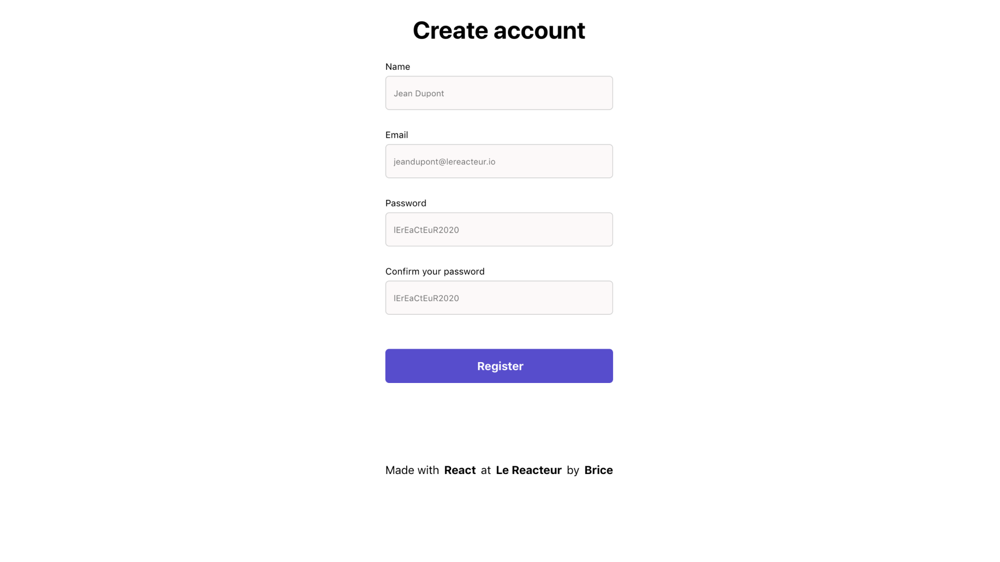
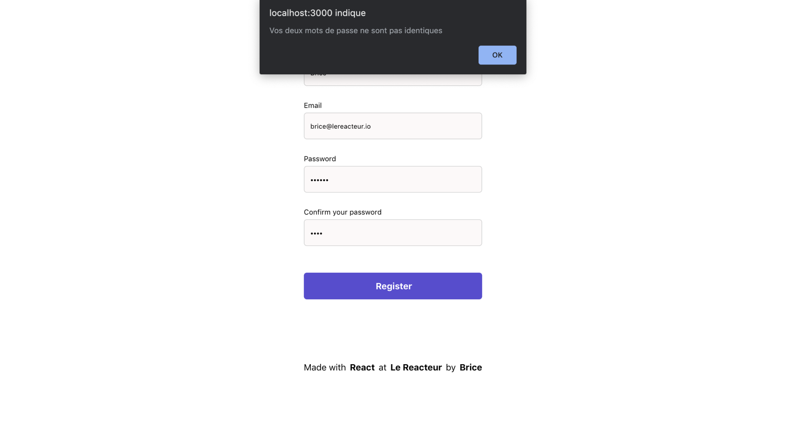
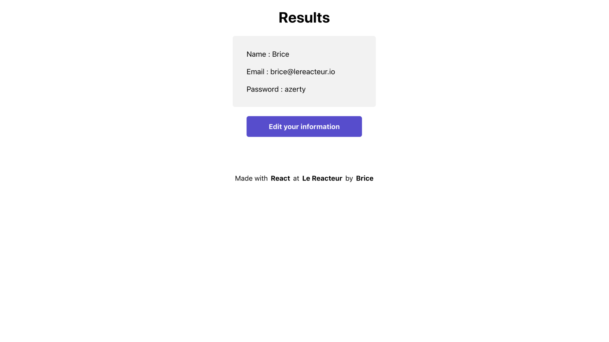
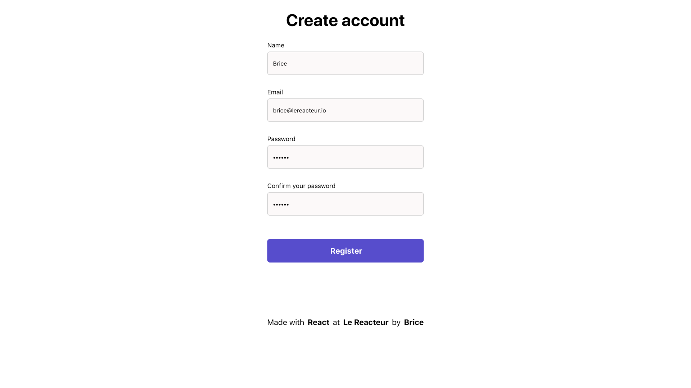

# Simple Form

Site déployé ➡️ [Simple Form](https://antancelin-simple-form.netlify.app)

Dans cet exercice, vous allez apprendre à réaliser un formulaire d'inscription simple.









<br>

- Créer un projet React à l'aide de la commande :

```
$ yarn create vite simple-form-app --template react
```

Vous devrez créer plusieurs composants (dont vous pouvez choisir le nom) :

- **'Form'** pour le formulaire
- **'StepTwo'** pour les résultats, une fois le formulaire validé
- **'Footer'**

Le projet crée devra être **'responsive'**.

Voici un [exemple](https://lereacteur-react-simple-form.netlify.app/) du résultat attendu.

## Bonus

- ajouter une bordure rouge sur les champs de mots de passe s'ils ne sont pas indentiques
